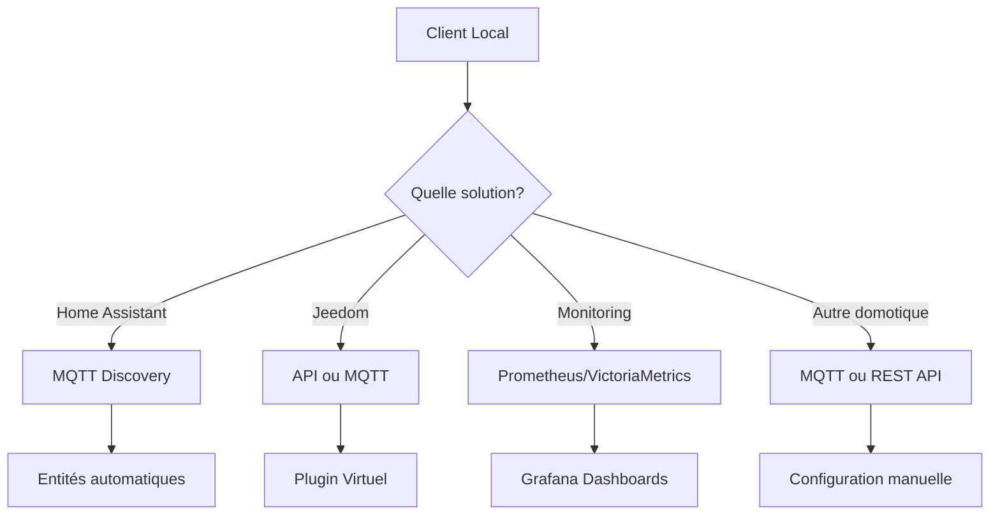

# Intégrations domotiques

Le client local MyElectricalData peut s'intégrer avec de nombreuses solutions domotiques pour exposer vos données de consommation et production électrique.

## Intégrations natives

| Solution | Méthode | Documentation |
|----------|---------|---------------|
| **Home Assistant** | MQTT Discovery | [Guide complet](./home-assistant) |
| **MQTT** | Broker MQTT | [Configuration](./mqtt) |
| **VictoriaMetrics / Prometheus** | Métriques | [Export métriques](./victoriametrics) |
| **Jeedom** | API / Plugin Virtuel | [Intégration](./jeedom) |

## Intégrations via MQTT

Toute solution supportant MQTT peut recevoir les données :

| Solution | Plugin/Méthode |
|----------|----------------|
| Domoticz | MQTT Client Gateway |
| OpenHAB | MQTT Binding |
| Gladys | Service MQTT natif |
| Node-RED | node-red-contrib-mqtt |
| Homey | MQTT Hub |

➡️ [Voir les autres intégrations](./autres)

## Intégrations via API REST

Le client expose une API REST locale sur le port 8080 :

```bash
# Consommation du jour
curl http://localhost:8080/api/consumption/daily

# Production du jour
curl http://localhost:8080/api/production/daily

# Statut
curl http://localhost:8080/api/status
```

Compatible avec :
- Scripts personnalisés (Python, JavaScript, etc.)
- Node-RED
- n8n / Zapier / Make
- Tout système supportant les requêtes HTTP

## Intégrations via métriques Prometheus

Pour les systèmes de monitoring :

| Système | Compatibilité |
|---------|---------------|
| VictoriaMetrics | Scraping + Push |
| Prometheus | Scraping |
| Grafana | Via datasource |
| InfluxDB | Via Telegraf |

➡️ [Configuration VictoriaMetrics](./victoriametrics)

## Choix de l'intégration



### Home Assistant

**Recommandé** si vous utilisez Home Assistant. L'intégration via MQTT Discovery crée automatiquement :
- Entités sensor pour consommation/production
- Compatibilité Energy Dashboard
- Long-term statistics

### Jeedom

Plusieurs options disponibles :
- Plugin Virtuel avec commandes info
- API JSON RPC directe
- MQTT via jMQTT

### Monitoring (Grafana)

Pour des dashboards avancés et une historisation longue durée :
- VictoriaMetrics ou Prometheus pour le stockage
- Grafana pour la visualisation
- Alerting intégré

### Autres solutions

Via MQTT ou API REST :
- Domoticz, OpenHAB, Gladys
- Node-RED pour des flux personnalisés
- Scripts et automatisations custom

## Combinaison d'intégrations

Vous pouvez activer plusieurs intégrations simultanément :

```yaml
home_assistant:
  enabled: true

mqtt:
  enabled: true

metrics:
  enabled: true

jeedom:
  enabled: false
```

Exemple : Envoyer les données à Home Assistant ET à VictoriaMetrics pour avoir à la fois l'interface domotique et des dashboards Grafana avancés.
