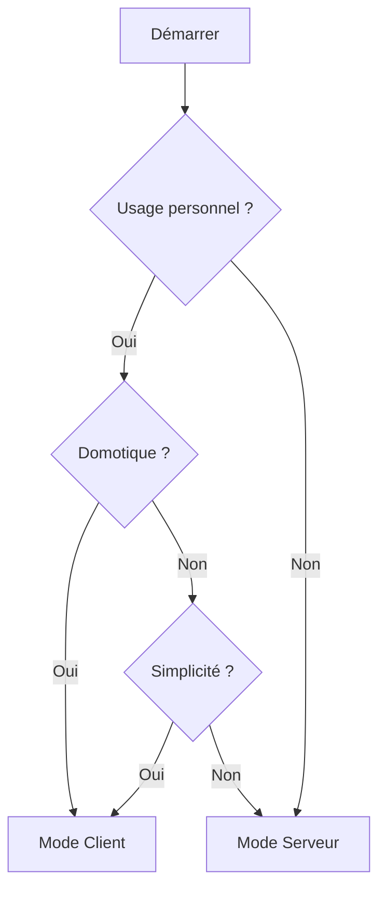

# Installation de MyElectricalData

Ce guide vous aide à choisir la méthode d'installation la plus adaptée à vos besoins.

## Modes d'exécution

MyElectricalData propose **deux modes d'exécution** distincts :

| Aspect | Mode Client (défaut) | Mode Serveur |
|--------|---------------------|--------------|
| **Cas d'usage** | Installation personnelle | Service multi-utilisateurs |
| **Utilisateurs** | Mono-utilisateur | Multi-utilisateurs |
| **Source des données** | API MyElectricalData | API Enedis directe |
| **Stockage** | PostgreSQL (permanent) | Cache Valkey (24h) |
| **Administration** | Aucune | Interface admin complète |
| **Exports domotique** | ✅ HA, MQTT, Jeedom | ❌ |
| **Prérequis Enedis** | Compte MyElectricalData | Identifiants développeur Enedis |

### Quel mode choisir ?



**Mode Client** (recommandé pour la plupart des utilisateurs) :

- Installation rapide, pas besoin d'identifiants Enedis développeur
- Intégration domotique native (Home Assistant, MQTT, Jeedom)
- Données stockées localement de façon permanente

**Mode Serveur** :

- Pour héberger un service multi-utilisateurs
- Accès direct aux API Enedis (nécessite un compte développeur)
- Interface d'administration complète

## Méthodes d'installation

### Docker Compose (recommandé)

La méthode la plus simple pour démarrer rapidement.

| Mode | Fichier | Documentation |
|------|---------|---------------|
| Client | `docker-compose.client.yml` | [Installation Docker Client](/setup/docker#mode-client) |
| Serveur | `docker-compose.yml` | [Installation Docker Serveur](/setup/docker#mode-serveur) |

```bash
# Mode Client (défaut)
docker compose -f docker-compose.client.yml up -d

# Mode Serveur
docker compose up -d
```

➡️ [Guide complet Docker](/setup/docker)

### Helm Chart (Kubernetes)

Pour les déploiements Kubernetes en production.

| Mode | Chart | Documentation |
|------|-------|---------------|
| Client | `myelectricaldata-client` | [Helm Client](/setup/helm#chart-client) |
| Serveur | `myelectricaldata-server` | [Helm Serveur](/setup/helm#chart-serveur) |

```bash
# Mode Client
helm install myelectricaldata ./helm/myelectricaldata-client

# Mode Serveur
helm install myelectricaldata ./helm/myelectricaldata-server
```

➡️ [Guide complet Helm](/setup/helm)

### Installation manuelle

Pour le développement local ou les configurations personnalisées.

```bash
# Backend (FastAPI)
cd apps/api
uv sync
uv run uvicorn src.main:app --reload --port 8081

# Frontend (React/Vite)
cd apps/web
npm install
npm run dev
```

➡️ [Guide développement](/setup/dev-mode)

## Comparatif des méthodes

| Critère | Docker Compose | Helm (K8s) | Manuel |
|---------|----------------|------------|--------|
| **Difficulté** | ⭐ Facile | ⭐⭐⭐ Avancé | ⭐⭐ Moyen |
| **Prérequis** | Docker | Kubernetes | Python, Node.js |
| **Scalabilité** | Limitée | Excellente | Aucune |
| **Mise à jour** | `docker compose pull` | `helm upgrade` | `git pull` |
| **Production** | ✅ Possible | ✅ Recommandé | ❌ Développement |

## Prochaines étapes

1. Choisissez votre mode : **Client** ou **Serveur**
2. Choisissez votre méthode : **Docker** ou **Helm**
3. Suivez le guide correspondant :
   - [Docker Compose](/setup/docker)
   - [Helm Chart](/setup/helm)

## Ressources

- [Configuration de la base de données](/setup/database)
- [Authentification](/setup/authentication)
- [Mode développement](/setup/dev-mode)
